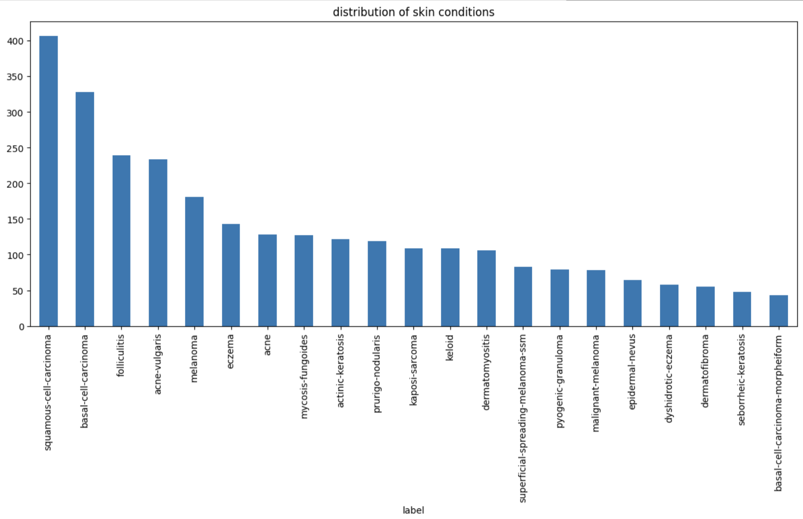
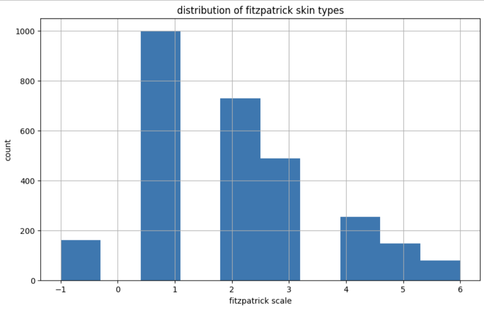
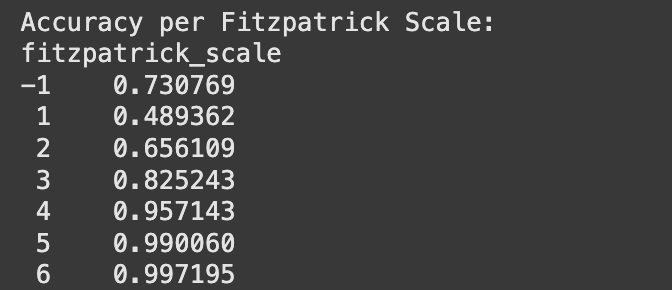

#  Algorithmic Justice League (AJL): Equitable AI for Dermatology

⚠️ _Remember to update the above title and remove all guidance notes and examples in this template, before finalizing your README_

---

### **👥 Team Members**

| Name | GitHub Handle | Contribution |
| ----- | ----- | ----- |
| Haley Boswell | @Haley-B | Led end-to-end development including exploratory data analysis (EDA), dataset curation (5 custom sets), label standardization, augmentation experiments, and submission strategy. Trained and evaluated ViT-Base, ViT-Large, ViT-Large (ImageNet-21k), MedViT-Base, and MedViT-Large (MedicalNet-22k) models. Maintained all notebooks and code infrastructure. Contributed to GitHub/README.md project development and analysis. |
| Jose Gonzalez | @josegonz115 | Contributed to EDA and created insightful visualizations. Trained and evaluated a ResNet50 model as part of model comparison. Contributed to GitHub/README.md project development and analysis.|
| Harini Pootheri| @hpootheri | Provided consistent team support through active participation and collaboration. Helped foster a positive and communicative team dynamic. Contributed to GitHub/README.md project analysis.|

---

# **🏗️ Project Overview**

**Objective of the Challenge**

The primary objective of this challenge was to develop an AI-driven model capable of accurately classifying 21 different skin conditions across diverse skin tones. This entailed creating a robust dataset representative of various skin types and training models to ensure equitable diagnostic performance, regardless of a patient's skin color.

**Real-World Significance and Potential Impact**

Our project addresses the significant underrepresentation of darker skin tones in medical imagery, which leads to misdiagnoses and delayed diagnoses, by incorporating skin tone-aware augmentation, balanced class sampling, and diverse datasets to ensure our AI model performs equitably and inclusively, reducing health disparities in diagnostic outcomes.

---

# **🎯 Project Highlights**

### ✅ **Best Model (Final Submission)**

- Fine-tuned a **Vision Transformer** model (**ViT-Large-Patch16-224**, pretrained on **ImageNet-21k**) using **transfer learning**, **targeted class balancing**, and **skin tone-aware augmentation**.
- Trained on a dataset of **4,270 images**, with **3,416 used for training** and **854 for validation**.
- This dataset included **untouched** and **minimally augmented** images from the original **Kaggle source data**.
  - Augmentations applied: **horizontal flip**, **vertical flip**, and **rotation** between **-45° to +45°**.
- Balanced skin tone representation using both **Fitzpatrick Centaur (FC)** and **Fitzpatrick Scale (FS)** labels:
  - Created skin tone subsets where **FC = FS**, then **augmented all groups** to match the largest (442 images).
  - Remaining images (where **FC ≠ FS**) were included to preserve data diversity.
- Conducted a **hyperparameter grid search** to optimize performance.
  - Final settings: **learning rate = 2e-5**, **weight decay = 0.01**.
- Trained for **5 epochs** to allow learning while minimizing **overfitting**.
- Used **AdamW** optimizer and **cross-entropy loss** from **PyTorch**.
- Achieved a final **macro F1 score of 0.66826** on the **Kaggle Private Leaderboard**.
- Ranked **7th overall** and secured **1st place in the UCLA cohort**.

#### 🧰 Techniques & Tools
- Preprocessing: `Albumentations`, `OpenCV`, `PIL`, and `Pandas`
- Modeling: `PyTorch`, `HuggingFace Transformers`, `MedViT`
- Evaluation: `F1 Score (macro)`, accuracy, and Kaggle leaderboard ranking

🔗 [Equitable AI for Dermatology | Kaggle Competition Page](https://www.kaggle.com/competitions/bttai-ajl-2025/overview)

---

# **📊 Data Exploration**

#### 🗂️ Internal Dataset (Kaggle)
- Subset of the FitzPatrick17k dataset with 2860 medical images across 21 skin condition classes. 
- Applied image resizing, normalization, and augmentation via `Albumentations`.

#### 🌐 External Dataset (Augmented)
- Combined HAM10000 + SD-198 + PAD-UFES-20 + ASCID with **standardized labels**.  
- Merged using a custom mapping script, balanced to **500 samples per class**.
- Augmentation included flips, rotation, elastic transforms, and light cropping.

## 🗃️ Source Data Overview

### Columns

Our dataset consisted of **2,860 rows** and **8 columns**, described in the table below:

| Column | Name                  | Description                                                                                          | Used? |
|--------|-----------------------|------------------------------------------------------------------------------------------------------|-------|
| 1      | `md5hash`             | Image Identifier ID / File Name                                                                      | Yes |
| 2      | `fitzpatrick_scale`   | Integer values -1, 1–6 describing **self-identified Fitzpatrick skin type**                         | Yes |
| 3      | `fitzpatrick_centaur`| Integer values -1, 1–6 describing **Centaur Labs-assigned Fitzpatrick skin type**                   | Yes |
| 4      | `label`               | The medical diagnosis label (e.g., eczema, melanoma, etc.)                                          | Yes |
| 5      | `nine_partition_label`| Value indicating one of nine diagnostic categories                                                  | No |
| 6      | `three_partition_label`| Value indicating one of three diagnostic categories                                                | No |
| 7      | `qc`                  | Quality control check by a **Board-certified dermatologist** (only available for limited images)    | No |
| 8      | `ddi_scale`           | Used to reconcile this dataset with another — **not relevant for our use case**                    | No |

### Labels/Target

As mentioned, our labels are meant to classify various skin conditions. Shown below are the various coniditions and their distribution among the dataset:


### Fitzpatrick Values

The key challenge in this project was handling the imabalance among skin tones, which was quite severe for darker skin tones (those with values >= 4 for FC/FS). We see this imbalance below:


The Heatmap shows discrepencies based on the color scale from 1 to -1. 


## Data Augmentation and Expansion Via External Datasets

We ultimately created 3 unique datasets using various methods, including augmentation and sourcing external data.

### Augmentations Applied:

- Horizontal Flips, Vertical Flips, Rotations (-45 to +45 degrees), Elastic Transforms, Grid Distortions, Affine Transformations (for image shifts only), Mild Cropping, Transpose, Mild Perspective Shifts

### External Datasets Used:

| Name | Link |
|--------|---|
| HAM10000     |[ ](https://www.kaggle.com/datasets/kmader/skin-cancer-mnist-ham10000) |
| SD-198    |[ ](https://paperswithcode.com/dataset/sd-198)
| PAD-UFES-20     |[ ](https://www.kaggle.com/datasets/mahdavi1202/skin-cancer)|
| ASCID    | [ ](https://www.kaggle.com/datasets/syedalinaqvi/augmented-skin-conditions-image-dataset/data)
 

#### Dataset 1: Medium Performance
  - Size: 6816 images
  - Extneral Images Used?: No
  - Augmentations Applied:
    - HorizontalFlip(p=1.0),  
    - Rotate(limit=(15,45), p=1.0)
    - VerticalFlip(p=1.0)
    - ElasticTransform(alpha=3, sigma=13, p=1.0)
    - GridDistortion(num_steps=5, distort_limit=0.03, p=1.0)
    - Affine(translate_percent=(0.02, 0.05), rotate=(0,0), scale=(1.0,1.0), p=1.0)
    - RandomResizedCrop(size = (224, 224), scale=(0.70, 0.90), p=1.0) 
- Augmentation Method:
    - For images with matching FC and FS values: augmented so there were 750 images total in each category (7 total)
    - For images with (FC and FS >= 3) & where (FC != FS): had 393 images, augmented to get 750 total
    - Then merged with these with the remaining unaugmented images to create the full dataset

#### Dataset 2: Best Performing Set
- Size: 4270 images
- External Images Used?: No
- Augmentations Applied:
  - HorizontalFlip(p=1.0)
  - Rotate(limit=45, p=1.0)
  - VerticalFlip(always_apply=True)
- Augmentation Method:
  - For images with matching FC and FS values: augmented so there were 442 images in each category, where 442 is the number of images in the skin tone group with most images (FC/FS = 1)
  - Then merged with these with the remaining unaugmented images to create the full dataset

  
#### Dataset 3: Worst Performing Dataset
- Size: 10491 images
- External Images Used?: Yes
    - Dataset: ASCID
        - Labels Provided: Acne, Eczema, Keratosis
    - Dataset: Ham10000
        - Labels Provided: BCC, DF, MEL
    - Dataset: PAD-UFES-20
        - Labels Provided: BCC, SCC, ACK, SEK, MEL
    - Dataset: SD198
        - Labels Provided: Acne_Vulgaris, Basal_Cell_Carcinoma, Bowen's_Disease, Dermatofibroma , Eczema , Epidermal_Nevus , Keloid , Malignant_Melanoma , Pyogenic_Granuloma , Seborrheic_Keratosis
- Augementations Applied:
  - HorizontalFlip(p=0.5)
  - VerticalFlip(p=0.3)
  - Rotate(limit=20, p=0.5)
  - RandomBrightnessContrast(p=0.3)
  - ColorJitter(p=0.3)
  - GaussianBlur(p=0.2)
- Augmentation Method:
    - Instead of balancing accross skin tones, we balanced it across all 21 labels


---

# **👩🏽‍💻 Setup & Execution**

This section provides instructions to set up the environment, download the necessary data, and run the code to reproduce the results of our best-performing model (ViT-Large fine-tuned on the Kaggle dataset).

### **Prerequisites**

Before you begin, ensure you have the following installed:

1.  **Git:** For cloning the repository.
2.  **Python:** Version 3.8 or higher is recommended.
3.  **pip:** Python's package installer (usually comes with Python).
4.  **Kaggle Account & API Key:** You need a Kaggle account to download the competition dataset. You also need to configure your Kaggle API key locally.
    *   **To get your API key:**
        1.  Log in to your Kaggle account.
        2.  Click on your profile picture and select "Account" from the drop-down menu.
        3.  Scroll down to the "API" section.
        4.  Click "Create New API Token". This will download a `kaggle.json` file containing your username and API key.
    *   **To configure the key:**
        *   **Linux/macOS:** Create a directory `~/.kaggle/` (if it doesn't exist) and move the downloaded `kaggle.json` file into it (`mv /path/to/downloaded/kaggle.json ~/.kaggle/kaggle.json`). Ensure the file has appropriate permissions (`chmod 600 ~/.kaggle/kaggle.json`).
        *   **Windows:** Create a folder named `.kaggle` inside your user profile directory (e.g., `C:\Users\<Your-Username>\.kaggle\`) and move the downloaded `kaggle.json` file into it.

### **Step-by-Step Instructions**

1.  **Clone the Repository:**
    Open your terminal or command prompt and run:
    ```bash
    git clone https://github.com/Haley-B/ajl.git
    cd ajl
    ```

2.  **Set Up a Virtual Environment:**
    It's highly recommended to use a virtual environment to manage project dependencies and avoid conflicts with other Python projects.
    ```bash
    # Create the virtual environment (named .venv)
    python3 -m venv .venv

    # Activate the virtual environment
    # On Linux/macOS:
    source .venv/bin/activate
    # On Windows (Command Prompt):
    # .\.venv\Scripts\activate.bat
    # On Windows (PowerShell):
    # .\.venv\Scripts\Activate.ps1
    ```
    You should see `(.venv)` appear at the beginning of your terminal prompt, indicating the environment is active.

3.  **Install Dependencies:**
    Install all the required Python packages listed in the `requirements.txt` file.
    ```bash
    pip install -r requirements.txt
    ```

4.  **Download Data:**
    *   **Competition Data:** Run the provided shell script to download the official Kaggle competition dataset using the Kaggle API key you configured earlier.
        ```bash
        # Optional: Ensure the script has execute permissions
        # chmod +x ./download_kaggle_data.sh

        # Run the script
        ./download_kaggle_data.sh
        ```
        *Note: This script should download the data (images and CSV files) into a designated directory within the project structure (e.g., a `data/` folder). Verify the script's output or contents if needed.*
    *   **Augmented Data:** To run experiments involving our pre-augmented datasets, you also need to run the notebook `[Notebook Name To Be Added].ipynb`. This notebook contains code to download these augmented images into the `data/augmented/` directory. *(Note: This step is not required to reproduce the final Kaggle submission result, which used only the original Kaggle data with minimal augmentation applied during training.)*

5.  **Run the Main Experiment Notebook:**
    The notebook `AJL_model_testing2_BestPerformance.ipynb` contains the code for our final, best-performing model. This includes data loading (using the data downloaded in Step 4 - Competition Data), applying minimal augmentations (flips, rotation), fine-tuning the ViT-Large model, evaluating performance, and potentially generating the submission file.
    *   Open the notebook using a tool like Jupyter Lab, Jupyter Notebook, or VS Code with Python extensions.
    *   Ensure your virtual environment (`.venv`) is selected as the kernel for the notebook.
    *   Run the cells sequentially from top to bottom.

### **Expected Outcome**

After successfully running the main experiment notebook (`AJL_model_testing2_BestPerformance.ipynb`), you should have:

*   Trained model weights saved (usually as `.pt` or `.pth` files).
*   Validation metrics printed (e.g., F1 score, accuracy).
*   Optionally, a `submission.csv` file generated, ready for upload to the Kaggle competition (if the competition is still active).

*Note: This repository may contain other notebooks exploring different datasets (including the augmented ones downloaded in Step 4) or models (like ResNet50, MedViT). The steps above focus specifically on reproducing the final submission result.*

---

# **🧠 Model Development**

### 🧪 Model Experiments

#### 🧠 ViT Experiments (Winning Architecture)
- Base and Large ViT model trained on augmented Kaggle dataset
- Base ViT trained on a smaller dataset containing only augmented images (no external data). 
- Testing Best Performance Hyperparameters: version `ViT Base` learning rate `1e-5`, dropout `0.1`, and `7 epochs`
- Kaggle Best Performance Hyperparameters: version `ViT Base`  learning rate `1e-5`, dropout `0.1`, and `5 epochs`

#### 🔁 ViT with External Dataset
- Trained with same hyperparameters on our **augmented dataset**
- Showed improved validation performance, but **worse Kaggle generalization**

#### 🧬 MedViT (Medical Vision Transformer)
- Tested MedViT with `MedViT_MedicalNet-22k` pretrained weights  
- Used full fine-tuning with dropout and cosine learning rate schedule  
- Model was very heavy and prone to **overfitting / memory issues**, yielding **low F1 (~0.33)*
  

# **📈 Results & Key Findings**


* Performance metrics:
  - Our best model scored 7th in the competition, with an F1 score of 0.66826.
* How your model performed across different skin tones:
  - Because we augmented so many more images from minority skin tone classes, these minority classes seemed to perform better upon validating model performance. This is because the training set essentially contains many copies of the images seen in our validation set for these skin classes, with the only difference being that the images are flipped or rotated. (Note: We do not have the data to evaluate actual testing performance in this regard.) 
  - 
* Insights from evaluating model fairness:
  - From our results, we believe that the development of a fair and accurate medical classification model is possible, but only with the right steps to address feature imbalances. Developers must seek diverse datasets that include images across all skin-tones and utilize balancing mechanisms to further bridge that gap. 


---

## **🖼️ Impact Narrative**

The underrepresentation of darker skin tones in medical imagery has profound implications on healthcare outcomes. A 2020 study revealed that only 18% of images in dermatology textbooks depicted dark skin tones, underscoring a significant gap in medical education. This lack of representation can lead to misdiagnoses or delayed diagnoses for patients with darker skin, further exacerbating health disparities.

Other studies have found similarly concerning statistics:
  - A 2018 study reported that only 4.5% of images in medical textbooks featured darker skin tones.
  - A review of 15 nursing textbooks found that only 12.3% of photo images and 2.4% of drawn graphics represented dark skin tones.
  - Another study analyzing 1,123 dermatology teaching images showed that just 14.9% featured skin of color (SoC), while 84.3% featured lighter tones.
  - Skin conditions like eczema and alopecia, which are prevalent in SoC populations, were among the least represented.

These disparities can have life-altering consequences. For example, research shows that melanoma—among the most deadly skin cancers—is diagnosed later and more aggressively in patients with darker skin due to lack of diagnostic familiarity. In one documented case, a biracial patient went undiagnosed with T-cell lymphoma for five years, being repeatedly misdiagnosed due to lack of awareness of how the condition appears on darker skin.

In parallel, generative AI and diagnostic models trained disproportionately on light-skinned imagery may fail to recognize conditions in people with SoC, compounding existing inequalities in healthcare access and outcomes.

By incorporating skin tone-aware augmentation, balanced class sampling, and diverse datasets, our project directly addresses these shortcomings. Our model development process prioritized fairness and inclusivity, creating AI that does not just perform well but performs equitably.

Efforts like this are a step toward closing the diagnostic gap, enhancing medical education, and building AI systems that work for everyone—regardless of skin tone. As AI continues to expand its footprint in clinical tools, representation is not just ethical—it’s **lifesaving**.

---

## **🚀 Next Steps & Future Improvements**

**Address the following:**

Our model is highly limited by our quality of data. This is because ViT models are very data-dependent and less impacted by hyperparameter tuning. Our best model used only lightly augmented images in the expanded dataset (rotations and flips) and used no external datasets outside of the Fitzpatrick 17k. However, it's important to note the images in the Fitzpatrick 17k dataset are already limited. While using only augmented images resulted in best model performance here, in practice, we believe real-time model performance would improve if external data is introduced. Additionally, due to the size of the datasets and training time, we were very limited on the number of models we could test with external data or a large number of augmented images. There is also a very large external medical image set called ISIC (https://www.isic-archive.com/) we would like to have used, but simply did not have the resources to download alongside all else. Ensembled methods are something we would also like to have experimented with, as we only had time to focus on individual models rather than combinations. We believe the latter would significantly improve performance as we had base-ViT, large-ViT and ResNet50 models all performing relatively well. 

---

## **📄 References & Additional Resources**

Dosovitskiy, A., Beyer, L., Kolesnikov, A., Weissenborn, D., Zhai, X., Unterthiner, T., ... & Houlsby, N. (2020). An Image is Worth 16x16 Words: Transformers for Image Recognition at Scale. arXiv. https://arxiv.org/abs/2010.11929

O'Malley, A., Veenhuizen, M., & Ahmed, A. (2024). Ensuring Appropriate Representation in Artificial Intelligence–Generated Medical Imagery: Protocol for a Methodological Approach to Address Skin Tone Bias. JMIR AI. https://doi.org/10.2196/58275

Perlman, K. L., Williams, N. M., Egbeto, I. A., Gao, D. X., Siddiquee, N., & Park, J. H. (2021). Skin of color lacks representation in medical student resources: A cross-sectional study. International Journal of Women's Dermatology, 7(2), 195–196. https://doi.org/10.1016/j.ijwd.2020.12.018

Kaundinya, T., & Kundu, R. V. (2021). Diversity of Skin Images in Medical Texts: Recommendations for Student Advocacy in Medical Education. Journal of Medical Education and Curricular Development. https://doi.org/10.1177/23821205211025855

McKay, K., et al. (2023). Representation of dark skin tones in foundational nursing textbooks. Nurse Education Today, 124, 105719. https://doi.org/10.1016/j.nedt.2023.105719

Ibe, C. (2024). On the Need for Diversity in Medical Illustrations [Podcast]. The Commonwealth Fund. https://www.commonwealthfund.org/publications/podcast/2024/apr/need-diversity-medical-illustrations

STAT News. (2023). Meet the medical illustrator challenging the lack of diversity in medicine. https://www.statnews.com/2023/08/22/diversity-medical-illustrations-chidiebere-ibe/

Myers, A. (2023). AI Shows Dermatology Educational Materials Often Lack Darker Skin Tones. Stanford HAI. https://hai.stanford.edu/news/ai-shows-dermatology-educational-materials-often-lack-darker-skin-tones

Figure 1 Editorial Team. (2023, July 3). Diverse Skin Tones in Medical Images and the Importance of Representation. Figure 1. https://www.figure1.com/resources/blog/diverse-skin-tones-in-medical-images-and-the-importance-of-representation/


---
